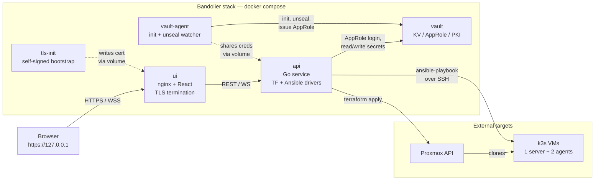
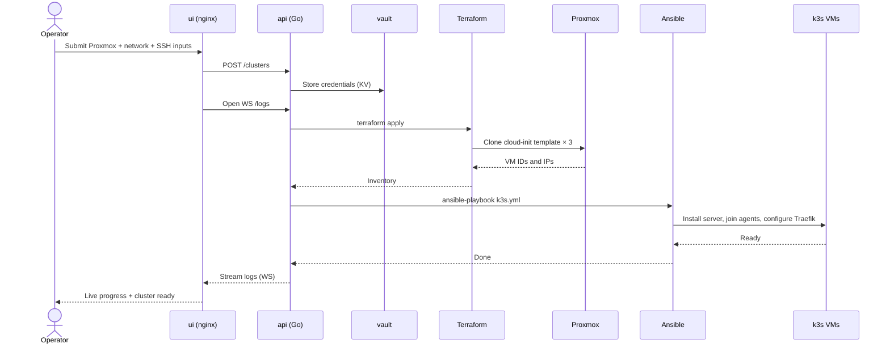

# Bandolier

> *Every cluster, on the belt.*

**A LazerDude Labs project.** Bandolier is a self-contained Docker Compose stack that deploys k3s clusters on Proxmox through a React UI — no controller VM, no host-side Vault, no bash glue.

## What it does

- `docker compose up` on any host with Docker + Proxmox network reachability.
- A web UI prompts for a master password, then collects Proxmox + network + SSH inputs.
- Provisions a 1-server + 2-agent k3s cluster end-to-end via Terraform + Ansible.
- Streams live deployment logs to the browser.
- Stores all credentials in a containerized HashiCorp Vault (no host-side Vault required).
- Vault auto-recovers on restart via an in-stack unseal watcher.

## Quick start

```bash
git clone https://github.com/lazerdude-labs/bandolier.git
cd bandolier/deploy
docker compose up -d --build
# Open https://127.0.0.1 in your browser; accept the self-signed cert.
# You'll land on the setup screen — pick a master password (12+ chars).
```

The first time you visit `https://127.0.0.1`, the UI lands on a setup screen and prompts you for a master password. After that, subsequent visits go straight to the cluster overview. The stack binds to `127.0.0.1:443` by default — loopback-only — so nothing is reachable from the LAN until you explicitly expose it.

> **Don't use `deploy/scripts/smoke.sh` for first-time install.** That script is for CI: it wipes volumes, pre-fills a fixed master password (`smoke-test-pw`), and runs assertions for the deploy → destroy → redeploy → password-change cycle. Use `docker compose up -d --build` for a clean install.

### Host requirements

- Docker Engine 24+ with the Compose v2 plugin (`docker compose version`).
- Outbound HTTPS to `releases.hashicorp.com`, `dl.k8s.io`, `get.helm.sh`, and `ghcr.io` (only during the first build; subsequent runs reuse the local image).
- Network reachability to your Proxmox API (only when you actually deploy a cluster — not for the stack itself).
- For running `deploy/scripts/smoke.sh` (CI/dev only): `jq`, `curl`, plus the above.

### What gets deployed

Three containers and a small set of named volumes:

| Container | Role |
|---|---|
| `vault` | HashiCorp Vault — KV, AppRole, PKI |
| `vault-agent` | Idempotent first-run setup + long-running unseal watcher |
| `api` | Go service driving Terraform + Ansible, serving the REST/WS API |
| `ui` | Static React build behind nginx (terminates TLS to localhost) |

Volumes: `vault-data`, `vault-init-state`, `tf-state`, `app-data`, `tls`.

### Prerequisites

- Docker + Docker Compose v2.
- A reachable Proxmox host with an API token that can clone a cloud-init template (Rocky 9, Ubuntu, etc.). See [`docs/proxmox-setup.md`](docs/proxmox-setup.md) for a step-by-step on token creation, required permissions, and storage layout.
- A `/24` (or larger) on a VLAN routable from your Proxmox host.
- A wildcard DNS record (or an authoritative DNS server you can update via TSIG) for the cluster's FQDN — optional, only required if you want Bandolier to issue per-app wildcard certs.

If a deploy fails, [`TROUBLESHOOTING.md`](TROUBLESHOOTING.md) collects the cases real operators have hit (token permissions, snippets content type, CDN HEAD-blocking, etc.) with verified fixes.

## How it's organized

```
api/        Go backend — Vault client, Terraform/Ansible drivers, REST/WS handlers
ui/         Vite + React + TypeScript frontend
terraform/  Proxmox VM provisioning module
ansible/    k3s + Traefik configuration
deploy/     docker-compose.yml + container images for vault, vault-agent, ui
```

The data model is designed for multi-cluster from day one even though v0.1 ships with single-cluster scope. Future profiles (red-team / blue-team scenario clusters) plug into the same shape.

## Architecture

### Runtime components

How the containers wire together and reach Proxmox. Everything inside the dashed box runs on the operator's host via `docker compose`; the only outbound traffic is to the Proxmox API and (later) the cloned VMs over SSH.



### Provisioning flow

What happens between hitting **Deploy** in the UI and a working k3s cluster. Logs stream back to the browser over a WebSocket throughout.



## Tear down

```bash
cd deploy
docker compose down       # keep volumes (resume later)
docker compose down -v    # destroy volumes (fresh start)
```

## Configuration

The `api` container reads its filesystem and service locations from environment variables. Defaults match the layout in [`deploy/docker-compose.yml`](deploy/docker-compose.yml); override any of them when you mount volumes elsewhere or run the api outside Compose.

| Env var | Default | Purpose |
|---|---|---|
| `BANDOLIER_DB_PATH` | `/var/lib/bandolier/app.db` | SQLite app DB |
| `BANDOLIER_VAULT_ADDR` | `http://vault:8200` | Vault HTTP endpoint |
| `BANDOLIER_VAULT_APPROLE_PATH` | `/vault-init-state/approle.json` | AppRole creds written by `vault-agent` |
| `BANDOLIER_TF_STATE_ROOT` | `/var/lib/bandolier/tf-state` | Per-cluster terraform state directories |
| `BANDOLIER_LOG_ROOT` | `/var/lib/bandolier/logs` | Deploy + apps install log files |
| `BANDOLIER_TERRAFORM_DIR` | (unset; image default) | Terraform module source dir mounted into the container |
| `BANDOLIER_ANSIBLE_DIR` | (unset; image default) | Ansible playbook + roles dir mounted into the container |

## Security model

Bandolier is designed for a single trusted operator on a single host. The Vault unseal keys live in a docker volume on the host so that auto-recovery works after reboot — see [`deploy/vault-init/THREAT_MODEL.md`](deploy/vault-init/THREAT_MODEL.md) for the full trust boundary. If you need a stricter model, run Bandolier on a dedicated host gated by other means (separate VLAN, jump host, hardware-backed auto-unseal).

## Versioning

Bandolier follows [SemVer](https://semver.org). Breaking changes bump the major version. Pre-1.0 (`0.x.y`), minor versions may include breaking changes; CHANGELOG entries call those out explicitly.

## Contributing

See [`CONTRIBUTING.md`](CONTRIBUTING.md). Bug reports and pull requests welcome via GitHub Issues.

## License

[MIT](LICENSE) — © LazerDude Labs.
